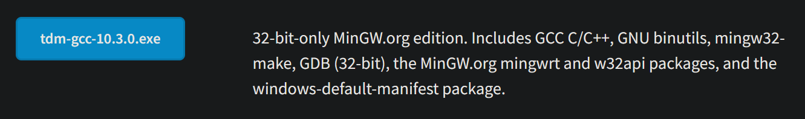

# Cài đặt thư viện graphics.h và winbgim.h trên VSCode (Trên Windows)

## Bước 1. Cài đặt TDM-GCC 32bit
- Truy cập vào đường link [https://jmeubank.github.io/tdm-gcc/download/](https://jmeubank.github.io/tdm-gcc/download/), tải file cài đặt 32bit như hình

  
- Mở file lên và cài đặt, không có lưu ý gì khác, cứ next.

## Bước 2. Copy thư viện graphics.h và winbgim.h vào thư mục TDM-GCC-32
Tải về thư mục [Graphics Header Files](ComputerGraphics/Install_Graphics.h/img/Untitled (6).png)
- Sau khi tải về, copy hai file là `graphics.h` và `winbgim.h`, dán vào thư mục `TDM-GCC-32\include` như video.

<video controls>
  <source src="Install_Graphics.h\img\20240120_132225.mp4" type="video/mp4">
  Your browser does not support the video tag.
</video>

- Copy file `libbgi.a`, dán vào thư mục `TDM-GCC-32\lib` như video

https://github.com/vinhveer/Study_Semester4_2023-2024/blob/631eb65ce6f85370f6110283266f2e6d76b89617/ComputerGraphics/Install_Graphics.h/img/20240120_132225.mp4

## Bước 3. Config VSCode

### Các extension cần cài đặt

- `Code Runner`
- C/C++ Extension Pack

### Config Code Runner

- Các bạn vào mục Settings → Tìm Code-runner: Execuror Map
- Tìm đến mục như hình, chọn Edit in settings.json
    

    
- Tại mục cpp, thay đổi lệnh biên dịch như sau
    
    ```powershell
    cd $dir && g++ $fileName -o $fileNameWithoutExt -lbgi -lgdi32 -lcomdlg32 -luuid -loleaut32 -lole32 && $dir$fileNameWithoutExt
    ```
    
    - Các bạn dán vào chỗ mình đã đánh dấu như trong hình là ok
    
    

## Hoàn tất
- Để chạy code, chọn `Run code` như video

<video controls>
  <source src="Install_Graphics.h\img\20240120_133857.mp4" type="video/mp4">
  Your browser does not support the video tag.
</video>
